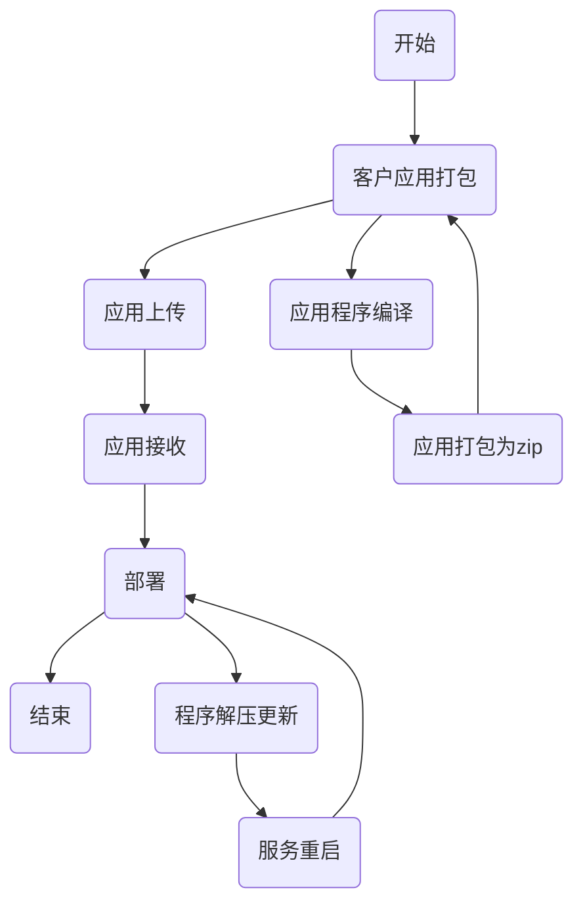
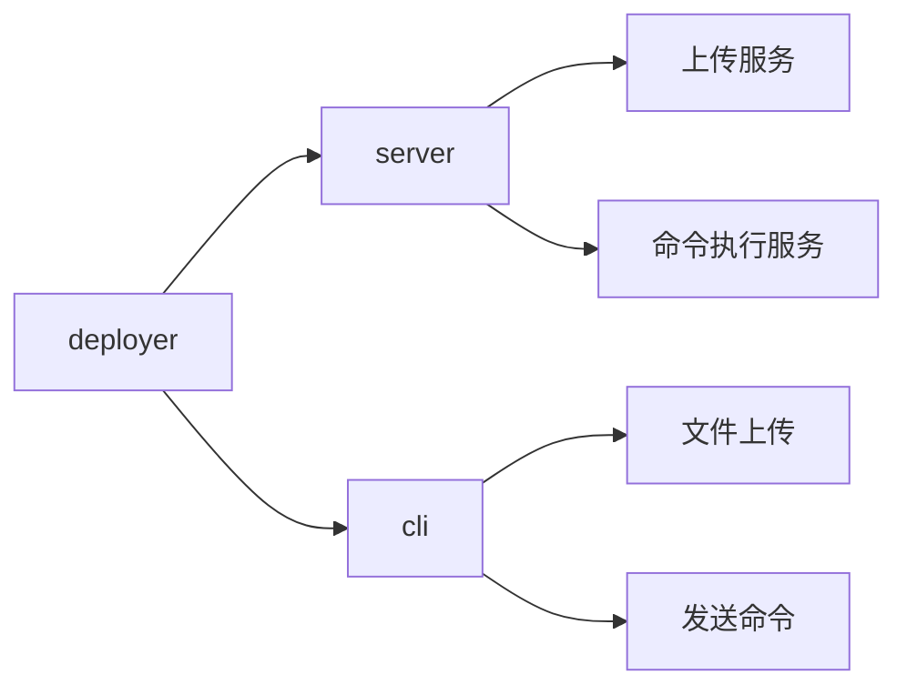

# Deployer 应用程序部署器

**实现原理：** 在服务器上搭建一个服务对外提供http接口接口如下：
1. 接收客户端上传的文件
2. 接收客户端发送的指令，此指令可以在服务端转换为shell命令在服务器上进行执行
3. 客户端程序需要执行命令来进行应用的打包

## 应用程序发布基础流程

### 程序框架

### 技术栈

- 开发语言： Rust
- 框架： Actix

### examples

添加
a add core https://www.google.com

打开
a open core

### Server 

服务端,根据类型进行不同的业务处理
action: install, update